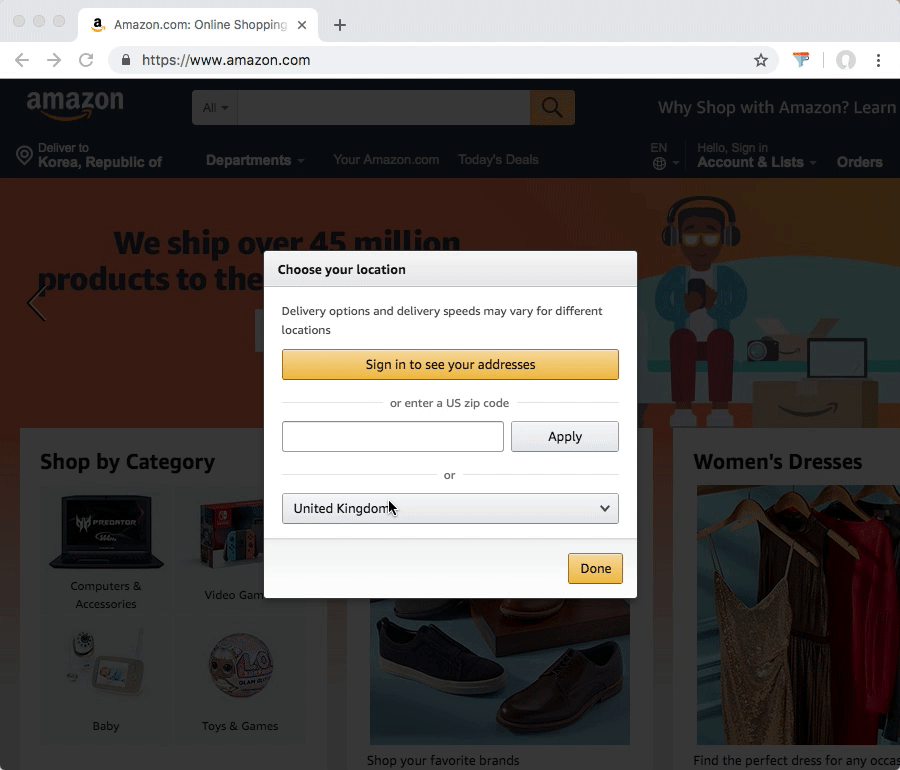

# Fuzzy Filter

This is a Google Chrome Extension that helps you to find keyword in the list by fuzzy search.

## Install

Available on the [Chrome Web Store](https://chrome.google.com/webstore/detail/fuzzy-filter/kcgldkebiaephahnedlmfkebkeijboab)

## Usage

1. Activate list element in the web page by click
2. Click this extension icon in the browser toolbar
3. Type characters to find
4. Move up/down and press enter key or mouse click

## Credits

Icons made by [Freepik](https://www.freepik.com/) from [www.flaticon.com](https://www.flaticon.com/) is licensed by [CC 3.0 BY](http://creativecommons.org/licenses/by/3.0/)

## License

[MIT](LICENSE) © CK Moon
